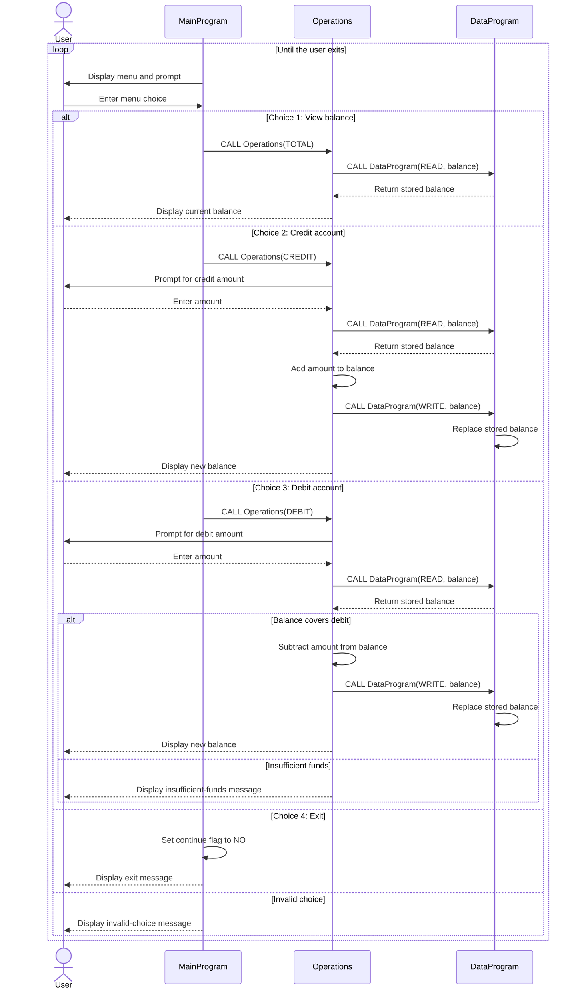

# COBOL Account Management System

## Purpose

This program provides a small, menu-driven account balance manager. It supports viewing the balance, crediting the account, debiting the account, and exiting. The current implementation manages one account only; it does not store student identities, account records, or student-specific details.

## Source files

- [`main.cob`](../src/cobol/main.cob) contains `MainProgram`, the interactive entry point. It displays the menu, accepts a choice, and dispatches view, credit, and debit requests to `Operations`. Choice 4 exits; other choices display an invalid-choice message.
- [`operations.cob`](../src/cobol/operations.cob) contains `Operations`, which handles the requested account action. It reads the amount for credits and debits, retrieves and updates the balance through `DataProgram`, and displays the result. A debit is declined when the requested amount is greater than the available balance.
- [`data.cob`](../src/cobol/data.cob) contains `DataProgram`, the balance storage interface. It supports `READ` to copy the stored balance to the caller and `WRITE` to replace the stored balance. The stored balance is initialized to `1000.00`.

## Business rules currently implemented

- The account starts with a balance of `1000.00`.
- A credit adds the entered amount to the balance.
- A debit subtracts the entered amount only when the balance is greater than or equal to the entered amount. Otherwise, the program displays an insufficient-funds message and leaves the balance unchanged.
- Balances and amounts use `PIC 9(6)V99`: up to six integer digits and two decimal digits, with an implied decimal point.
- There is no student-specific logic or per-student balance. The balance is held in COBOL working storage rather than a persistent database or file.
- The program does not explicitly validate that an entered amount is positive or handle input-format errors; those behaviors are not defined as business rules here.

## Application data flow

